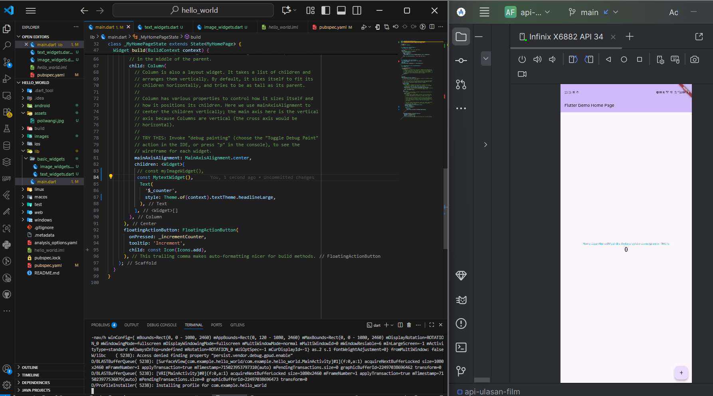
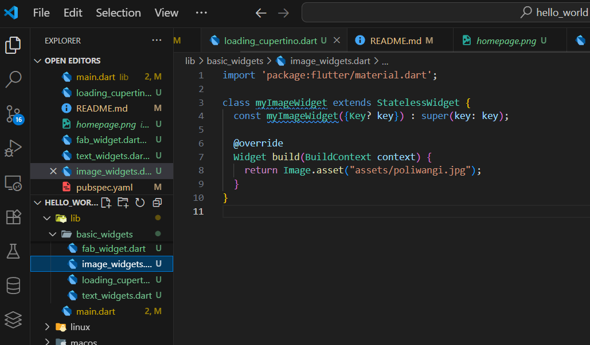

# Project Hello World
### dibuat oleh:
- Nim   :Ahmad Maulidin
- Nama  :362458302146
- Kelas :2D TRPL

## pendahuluan
Laporan ini di buat setelah melalkukan beberapa langkah-langkah dalam membuat  project hello world mulai dari membuat project, menghubungkan komputer/emulator ke android, membuat repository git hub dan mengepush project ke dalam repository git hub, hingga menerapkan widget dasar pada code. 

# Langkah - Langkah Praktikum
## Praktikum 1: Membuat Project Flutter Baru
- membuka cmd
- ketikan perintah flutter create Hello_word untuk membuat project flutter baru
- tunggu sampai semua terinstall

## Praktikum 2: menhubungkan emulator ke  android
- install android studio
- pastikan laptop dan perangkat dalam jaringan yang sama
- pastikan laptop memiliki SDK platform Tools
- kemudian masuk running device dan klik tombol + 
- pilih pair device using wifi dan dia akan menampilkan login dengan code qr atau code 6 digit 
- pada perangkat android mauk ke bagian opsi developper
- cari proses debug dengan nirkable dan hidupkan
- selanjutnya klik akan di bawa pada opsi pemilihan mau menggunakan qr atau masukan angka 6 digit
- scan code qr dan tunggu hingga selesai
- setelah berhasil kemudian kembali ke running device dan klik tombol + lagi dan perangkat android akan muncul di sana.
 

## Praktikum 3: membuat repository git hub dan laporan praktikum
- pastikan sudah memiliki akun github
- membuat repository dengan menggunakan nama "Flutter-fundamental-part1"
-kemudian masuk kembali ke dalam vs code dan buka terminal yang ada pada vs code
-lakukan push dengan cara mengetikan code sebegai berikut:

- akan tetapti pada code git add Readme.md diganti dengan git add . agar dapat mengupload/push semua data yang ada pada project ke dalam repository 
- hasil push pada repository akun github:
  

## Praktikum 4: Menerapkan Widget Dasar
- membuat folder baru dengan nama basic_widgets dalam directory /lib
- setelah membuat  folder kita masuk pada directory /lib/basic_widget dan membuat 2 file dengan nama image_widgets dan text_widgets
- kemudian masuk kedalam dan file text_widgets dan buat ide secreatif mungkin dan saya di sini membuat project nyz menampilkan tulisan "Nama saya Ahmad Maulidin, Sedang belajar pemrograman Mobile"

- Hasilnya seperti ini:

- untuk file image_widget sama juga coba untuk menambahkan foto atau image yang semenarik mungkin untuk contoh saya disini menggunakan logo poliwangi
- untuk Codenya seperti ini: 

- Untuk hasilnya seperti ini:

- penting ketika menambahkan directory asset maka pada pubsyml nya harus diinisialisasikan juga kemudian lakukan perintah pub get pada  terminal vs code dan di letakkan di bawah uses-material-design: true.

